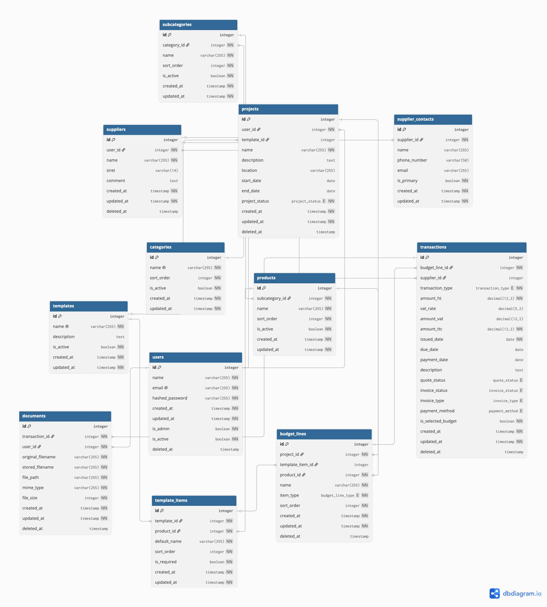
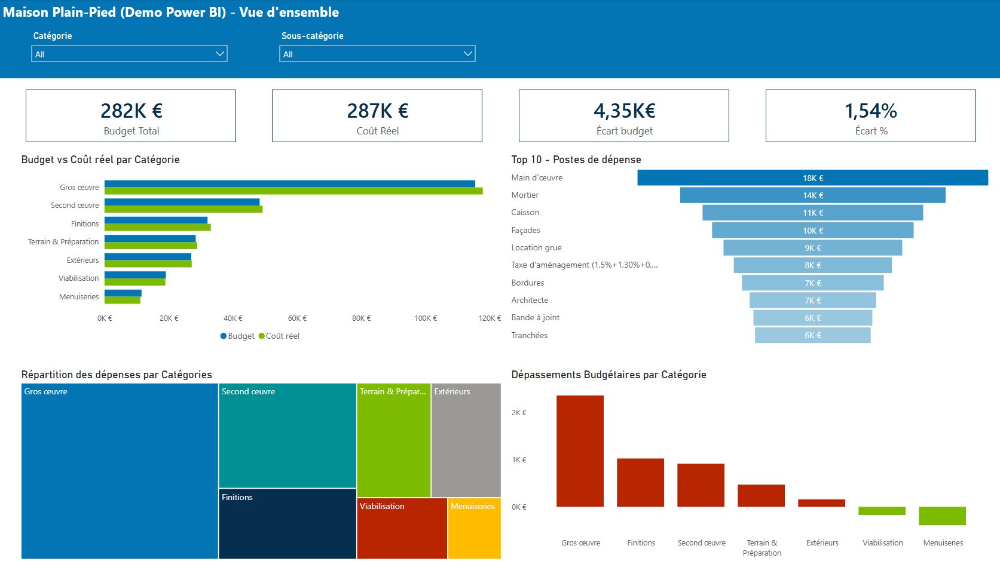
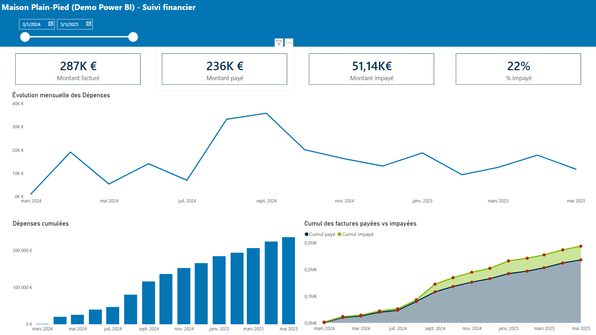
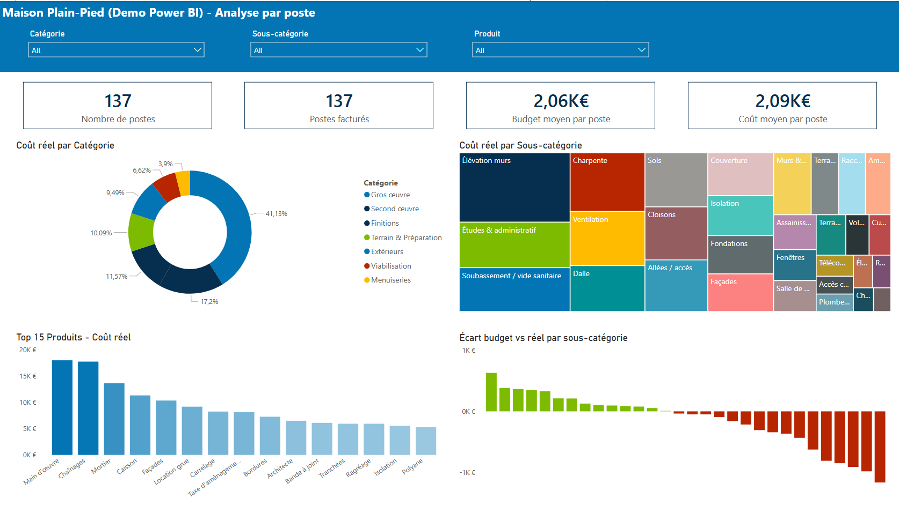
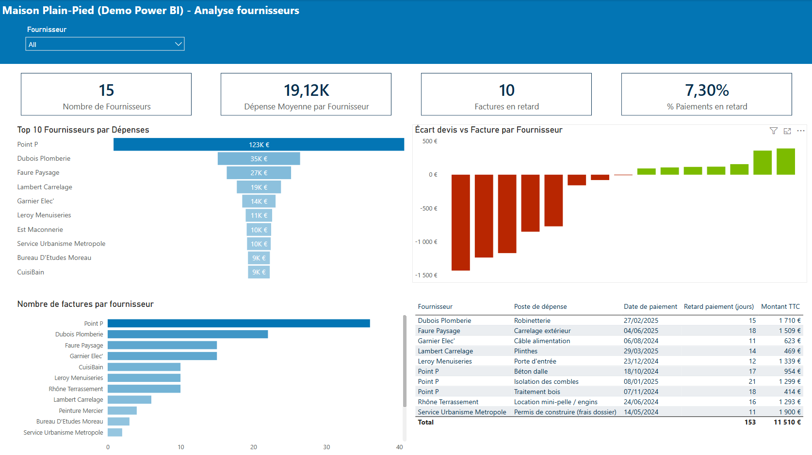

# Bâti Budget

<div align="center">

### Application web de budgétisation et de suivi financier de chantier

Piloter le budget d'une construction ou d'une rénovation : devis, factures, fournisseurs, documents et tableau de bord, dans une application full-stack moderne issue d'un prototype Excel éprouvé.

<br>


<br>


-blue?style=flat-square)


</div>

---

# Aperçu du projet

**Bâti Budget** est une application web full-stack conçue pour centraliser et simplifier le pilotage financier d'un projet de construction ou de rénovation de maison : planification du budget, comparaison des devis, gestion des fournisseurs, suivi des factures, stockage des documents et reporting.

Elle est née d'un classeur Excel avancé — tables structurées, Power Query, formules et VBA — utilisé pendant plusieurs années pour suivre la construction d'une maison :

[budget_construction_excel](https://github.com/luneroka/budget_construction_excel)

L'application web ne reproduit pas le classeur écran par écran. Elle conserve la logique métier éprouvée et remplace les mécanismes propres au tableur par une base de données normalisée, une API sécurisée, des services métier dédiés et une interface moderne organisée par projet.

Le produit est **« budget-first »** : il répond avant tout aux questions d'un particulier qui gère lui-même son chantier.

- Quels travaux et quels produits composent le projet ?
- Quels devis ou estimations DIY définissent le budget prévisionnel actuel ?
- Combien a réellement été facturé et payé ?
- Quels fournisseurs, documents et transactions se rattachent à chaque poste ?
- Où le projet est-il au-dessus ou en dessous du budget ?
- Quelles actions financières restent à traiter ?

L'application est **déployée en production** depuis juillet 2026 et utilisée au quotidien. L'accès se fait sur invitation.

---

# Contenu du dépôt

Ce dépôt contient le **code source complet** de Bâti Budget : API FastAPI (`backend/`), interface React (`frontend/`), infrastructure Docker Compose et Caddy, couche analytique et rapport Power BI (`analytics/`), ainsi que la documentation d'architecture, de déploiement et de sécurité (`docs/`). Le code est publié sous licence MIT.

L'application est en production et contient des données financières personnelles : ces données ne font naturellement pas partie du dépôt, et l'accès à l'instance en ligne se fait uniquement sur invitation.

---

# Fonctionnalités principales

## Projets et modèles de chantier

- création d'un projet à partir d'un **modèle de construction** prédéfini (catégories, sous-catégories, produits)
- statut, dates et localisation du projet
- plusieurs projets par utilisateur, chacun avec son propre périmètre

## Budget structuré

- hiérarchie **catégorie → sous-catégorie → produit** issue d'un catalogue géré par l'administrateur
- **lignes budgétaires** représentant soit un produit entier, soit des sous-postes détaillés (répartition par lot, par pièce, par prestation)
- conversion d'un produit entier en sous-postes sans perdre les transactions existantes
- budget prévisionnel calculé à partir des devis ou estimations **sélectionnés comme budget**
- comparaison permanente budget prévisionnel / engagé / facturé / payé

## Transactions : devis, estimations DIY, factures

- trois types de transactions avec leurs statuts propres (devis à confirmer, à négocier, validé, rejeté ; facture d'acompte, intermédiaire, de solde ; facture payée / impayée)
- montants HT, TVA et TTC avec validation croisée automatique
- dates d'émission, d'échéance et de paiement
- sélection d'un devis ou d'une estimation comme référence budgétaire d'un poste
- rattachement à un fournisseur et à une ligne budgétaire

## Fournisseurs et contacts

- fiche fournisseur avec SIRET, adresse normalisée et **plusieurs contacts** (un contact principal)
- RIB et documents fournisseur stockés et consultables
- historique des transactions et performance par fournisseur

## Documents

- pièces jointes aux transactions (devis, factures) et aux fournisseurs (RIB) : PDF, JPEG, PNG, HEIC
- validation du **contenu réel** des fichiers (signature binaire), pas seulement de l'extension
- stockage privé sur Cloudflare R2, jamais exposé publiquement : téléchargement et prévisualisation via des liens signés à durée limitée
- visionneuse intégrée avec navigation entre les documents d'une même transaction

## Tableau de bord

- **KPIs financiers** : budget prévisionnel, engagé, facturé, payé, reste à payer, écart budget / réel
- **graphiques** : dépenses dans le temps, budget vs réel par catégorie, répartition par catégorie et par fournisseur
- **centre d'actions** : factures impayées, devis à confirmer, devis à négocier, budget à valider, documents manquants, transactions récentes, alertes de dépassement

## Exports

- export comptable **CSV** par projet, filtrable par période et par type de transaction
- capture du tableau de bord en image pour partage

## Corbeille et intégrité des données

- suppression **douce** (soft delete) des transactions, documents et fournisseurs
- corbeille par projet avec restauration ou suppression définitive, en respectant les dépendances (restaurer le parent avant l'enfant)
- unicité et contraintes gérées en base, y compris pour les éléments supprimés

## Comptes et administration

- comptes créés par l'administrateur, mot de passe choisi par l'utilisateur via un lien sécurisé
- réinitialisation de mot de passe par e-mail
- signalement de bug ou suggestion depuis l'application, avec captures d'écran, envoyé par e-mail au support
- gestion des utilisateurs, du catalogue et des modèles réservée aux administrateurs

---

# Architecture

```text
Navigateur (SPA React)
    │  HTTPS
    ▼
Caddy  ──  fichiers statiques du frontend
    │       + reverse proxy /api/*
    ▼
FastAPI (Python, async)
    ├── PostgreSQL (SQLAlchemy async, migrations Alembic)
    ├── Cloudflare R2 (documents, liens signés)
    └── Resend (e-mails transactionnels)
```

| Couche | Technologies et responsabilités |
| --- | --- |
| Frontend | React 19, TypeScript, Vite, React Router, TanStack Query & Table, React Hook Form, Zod, Recharts, Tailwind CSS |
| API | Python 3.12, FastAPI, Pydantic v2, SQLAlchemy 2 async, asyncpg |
| Base de données | PostgreSQL 15, migrations Alembic, contraintes et index partiels tenant compte du soft delete |
| Authentification | JWT d'accès de courte durée en mémoire + refresh token rotatif en cookie `httpOnly`, détection de réutilisation, réinitialisation par lien signé |
| Documents | Cloudflare R2 privé, accès exclusivement via l'API |
| E-mails | Resend (réinitialisation, notifications de sécurité, signalements) |
| Environnement de développement | Docker Compose : frontend (Vite), API (rechargement à chaud), PostgreSQL, base de test |
| Production | Docker Compose sur VPS Ubuntu, Caddy en HTTPS automatique (Let's Encrypt), API et base de données sur le réseau interne uniquement |
| Qualité | Pytest / pytest-asyncio, Ruff, TypeScript strict, GitHub Actions |

## Organisation du backend

```text
models → schemas → repositories → services → routers
```

- **Models** : entités persistées et relations
- **Schemas** : validation des entrées / sorties de l'API
- **Repositories** : accès aux données et règles de persistance, toujours filtrés par utilisateur
- **Services** : orchestration des workflows et logique métier
- **Routers** : endpoints HTTP authentifiés, sans duplication de logique

Les calculs financiers sont centralisés dans un **moteur financier** unique plutôt que recalculés par chaque endpoint ou composant : une seule source de vérité pour les KPIs, les graphiques, les alertes et les exports.

## Modèle de données



---

# Sécurité

Le projet a fait l'objet d'une **revue de sécurité complète** avant sa mise à disposition, avec un plan de remédiation entièrement appliqué.

- authentification : JWT d'accès court, refresh token rotatif stocké haché, révocation de toute la session en cas de réutilisation, tokens invalidés dès qu'un mot de passe change
- pas d'inscription publique : comptes créés par l'administrateur, politique de mot de passe (12 caractères minimum)
- limitation de débit sur la connexion, la réinitialisation et les formulaires publics, verrouillage de compte après échecs répétés
- changement d'adresse e-mail soumis au mot de passe actuel, avec notification de l'ancienne adresse
- cloisonnement strict des données par utilisateur, vérifié par une matrice de tests couvrant chaque ressource, y compris les identifiants croisés (parent d'un utilisateur, enfant d'un autre) et ceux transmis dans le corps des requêtes
- validation des fichiers par signature binaire, limites de taille à la périphérie et dans l'API
- en-têtes HTTP : HSTS, Content-Security-Policy, X-Frame-Options, Permissions-Policy, Cross-Origin-Opener-Policy, Cross-Origin-Resource-Policy, `Cache-Control: no-store` sur l'API
- documentation OpenAPI désactivée en production
- conteneurs durcis : utilisateur non root, système de fichiers en lecture seule, capacités Linux retirées, `no-new-privileges`
- journal des événements de sécurité (connexions, verrouillages, réinitialisations, actions d'administration)
- sauvegardes chiffrées quotidiennes hors serveur et miroir des documents, avec alerte en cas d'échec
- audit automatique des dépendances (pip-audit, npm audit, Dependabot) et détection de secrets dans l'intégration continue
- scans OWASP ZAP : passif sur le site en production, actif sur l'API (authentifié, piloté par la spécification OpenAPI) sur un environnement local

---

# Couche analytique et Power BI

En plus de l'application, la base de données expose un schéma `analytics` composé de vues prêtes pour le reporting, alimentant un tableau de bord Power BI.

```text
FastAPI → PostgreSQL (schéma public) → vues analytics → Power BI
```

- vues de faits : lignes budgétaires, transactions
- vues de synthèse : résumé par projet, performance fournisseurs, trésorerie mensuelle, activité de facturation mensuelle
- jeu de données de démonstration généré pour illustrer un chantier complet

<table>
<tr>
<td width="50%"></td>
<td width="50%"></td>
</tr>
<tr>
<td width="50%"></td>
<td width="50%"></td>
</tr>
</table>

---

# Qualité et intégration continue

- **258 tests backend** (unitaires, intégration, API) exécutés contre une vraie base PostgreSQL
- vérification à chaque commit que l'ensemble des migrations s'applique sur une base vide, comme en production
- lint Ruff côté Python, TypeScript strict et oxlint côté frontend
- analyse de secrets (gitleaks), audit hebdomadaire des dépendances, mises à jour automatisées par Dependabot
- convention d'erreurs API structurée (`code` stable + message), traduite côté interface

---

# Exploitation

- déploiement par Docker Compose sur un VPS, une seule commande pour reconstruire et redémarrer, migrations appliquées automatiquement avant l'API
- Caddy en façade : HTTPS automatique, en-têtes de sécurité, limite de taille des requêtes, cache long des assets fingerprintés et revalidation systématique de `index.html`, seul conteneur exposé
- sauvegardes PostgreSQL chiffrées (`pg_dump | gzip | AES-256`) vers un stockage hors serveur, rétention locale et distante, procédure de restauration testée
- supervision des erreurs applicatives via Sentry (sans données personnelles)
- runbook complet : installation, durcissement du serveur, déploiement, retour arrière, reprise après sinistre

---

# Origine et évolutions

| Étape | Contenu |
| --- | --- |
| Prototype Excel | Suivi budgétaire complet sous Excel / VBA / Power Query, utilisé sur un chantier réel |
| Migration web | Base normalisée, API FastAPI, interface React par projet, stockage documentaire cloud |
| Production | Déploiement sur VPS, sauvegardes, supervision, revue de sécurité |
| Pistes | Gestion du catalogue depuis l'interface d'administration, sélections budgétaires multiples, partage de projet entre utilisateurs |

---

<div align="center">

Conçu et développé par **Yoann R.** — [luneroka.dev](https://luneroka.dev) · [LinkedIn](https://www.linkedin.com/in/robertyoann/) · [GitHub](https://github.com/luneroka)

</div>
