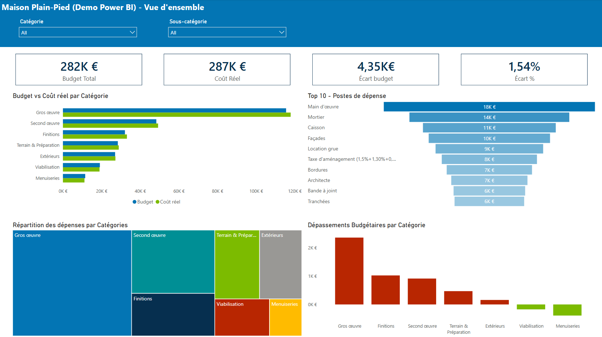
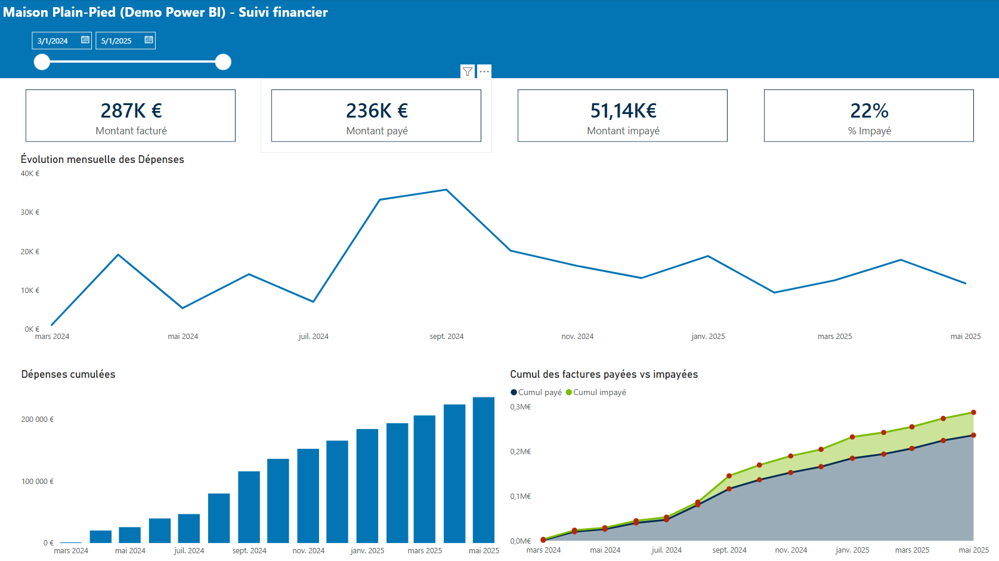
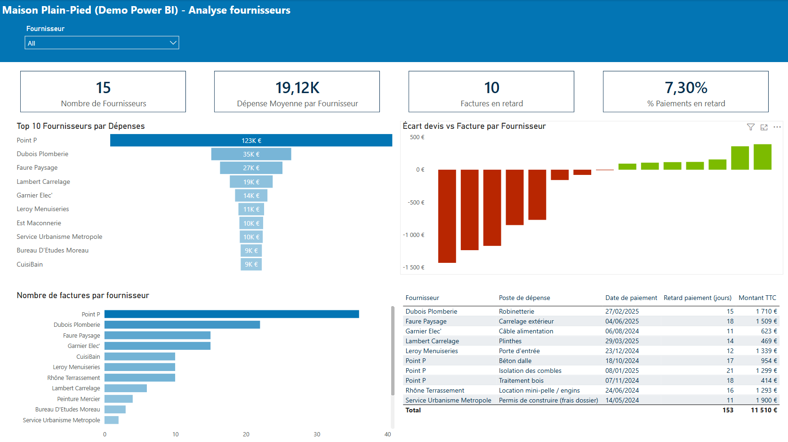
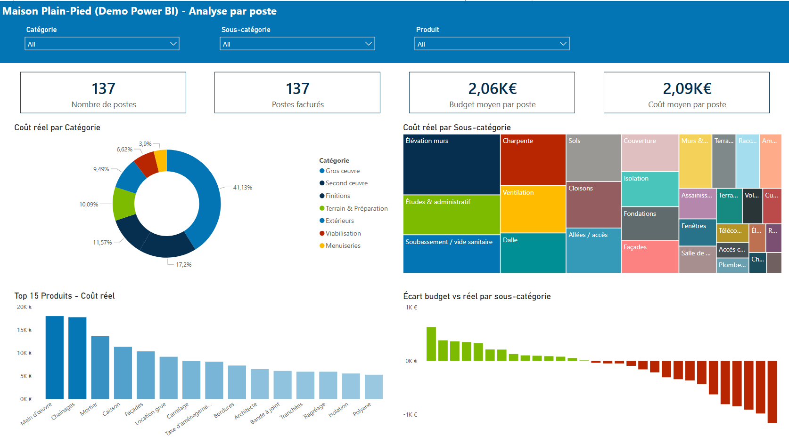

# Analytics Layer

This folder contains the SQL assets used to transform the operational PostgreSQL database into a reporting layer for Power BI.

The application stores normalized operational data in the `public` schema. The `analytics` schema exposes BI-ready views designed for reporting and dashboarding.

## Architecture

```text
FastAPI
    ↓
PostgreSQL (public schema)
    ↓
Analytics Views (analytics schema)
    ↓
Power BI
```

## Analytics Views

### Fact Views

- `analytics.vw_project_items_fact`
- `analytics.vw_transactions_fact`

### Summary & Reporting Views

- `analytics.vw_project_summary`
- `analytics.vw_supplier_performance`
- `analytics.vw_monthly_cashflow`
- `analytics.vw_monthly_invoice_activity`

## Power BI Demo Dataset

A realistic construction project dataset can be generated with:

```bash
python -m app.seed.seed_powerbi_demo --reset
```

The generated data is stored in PostgreSQL and exposed through the analytics views.

## Power BI Dashboard

A Power BI report is included in this folder and connects directly to the analytics schema.

The report demonstrates a complete BI workflow:

- SQL analytics layer
- Data modeling
- KPI design
- Financial reporting
- Supplier performance analysis
- Budget vs actual variance analysis
- Interactive Power BI dashboards

### Dashboard Pages

#### 1. Project Overview

Executive overview of project performance:

- Total Budget
- Actual Cost
- Budget Variance
- Variance %
- Budget vs Actual
- Top Cost Drivers
- Category Cost Breakdown
- Budget Variance by Category



---

#### 2. Financial Monitoring

Cashflow and payment tracking:

- Invoiced Amount
- Paid Amount
- Unpaid Amount
- Unpaid %
- Monthly Spending Trend
- Cumulative Spending
- Paid vs Unpaid Analysis



---

#### 3. Supplier Analysis

Supplier performance and procurement monitoring:

- Number of Suppliers
- Average Spend per Supplier
- Late Invoice Metrics
- Late Payment Rate
- Top Suppliers by Spend
- Quote vs Actual Variance
- Top Suppliers by Invoice Count
- Late Payment Detail Table



---

#### 4. Detailed Cost Analysis

Detailed breakdown of project items:

- Product Count
- Invoiced Items
- Average Budget per Item
- Average Cost per Item
- Category Distribution
- Subcategory Distribution
- Top Products by Cost
- Budget Variance by Subcategory



## Folder Structure

```text
analytics/
├── powerbi/
│   ├── budget_construction.pbip
│   ├── budget_construction.Report/
│   └── budget_construction.SemanticModel/
│
├── screenshots/
│   ├── powerbi_budget_construction_demo_project_overview.png
│   ├── powerbi_budget_construction_demo_cost_analysis.png
│   ├── powerbi_budget_construction_demo_supplier_performance.png
│   └── powerbi_budget_construction_demo_detailed_analysis.png
│
├── sql/
│   ├── schema.sql
│   ├── vw_project_summary.sql
│   ├── vw_project_items_fact.sql
│   ├── vw_transactions_fact.sql
│   ├── vw_supplier_performance.sql
│   ├── vw_monthly_cashflow.sql
│   └── vw_monthly_invoice_activity.sql
│
└── README.md
```
